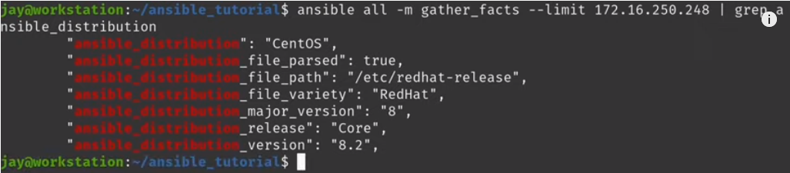

# ansible-tutorial
## video number 7
### the 'when' Conditional

- recongnize the version of os
    
    >cat &nbsp; /etc/os-release

- limit running ansible to a specific server

    > ansible all -m gather_facts --limit &nbsp; #ip_address

     
    ansible variable:

    
